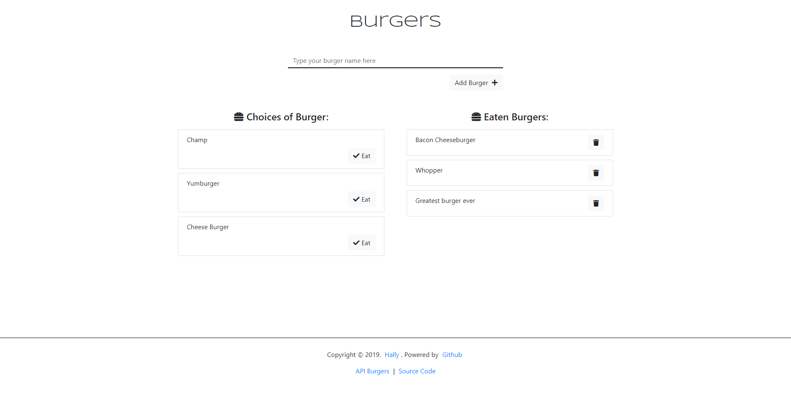

# Eat da Burger

It's an app of a burger logger with MySQL, Node, Express, Handlebars and a homemade ORM (yum!). Following the MVC design pattern; using Node and MySQL to query and route data in the app, and Handlebars to generate the HTML.

**Project Requirements:**
	:white_check_mark: Lets users input the names of burgers they'd like to eat.
	:white_check_mark: Whenever a user submits a burger's name, the app will display the burger on the left side of the page -- waiting to be devoured.
	:white_check_mark: Each burger in the waiting area also has a `Devour it!` button. When the user clicks it, the burger will move to the right side of the page.
	:white_check_mark: The app will store every burger in a database, whether devoured or not.
	
## :open_file_folder: Files
```
burger
├─ .git
│ ├─ config
│ ├─ description
│ ├─ FETCH_HEAD
│ ├─ HEAD
│ ├─ hooks
│ │ ├─ applypatch-msg.sample
│ │ ├─ commit-msg.sample
│ │ ├─ fsmonitor-watchman.sample
│ │ ├─ post-update.sample
│ │ ├─ pre-applypatch.sample
│ │ ├─ pre-commit.sample
│ │ ├─ pre-push.sample
│ │ ├─ pre-rebase.sample
│ │ ├─ pre-receive.sample
│ │ ├─ prepare-commit-msg.sample
│ │ └─ update.sample
│ ├─ index
│ ├─ info
│ │ └─ exclude
│ ├─ logs
│ │ ├─ HEAD
│ │ └─ refs
│ │ ├─ heads
│ │ │ └─ master
│ │ └─ remotes
│ │ └─ origin
│ │ └─ HEAD
│ ├─ objects
│ │ ├─ info
│ │ └─ pack
│ │ ├─ pack-f8394d29001965eb43855f054daf571cce1fd7bb.idx
│ │ └─ pack-f8394d29001965eb43855f054daf571cce1fd7bb.pack
│ ├─ packed-refs
│ └─ refs
│ ├─ heads
│ │ └─ master
│ ├─ remotes
│ │ └─ origin
│ │ └─ HEAD
│ └─ tags
├─ .gitignore
├─ config
│ ├─ connection.js
│ └─ orm.js
├─ controllers
│ └─ burger_controllers.js
├─ db
│ ├─ schema.sql
│ └─ seeds.sql
├─ models
│ └─ burger.js
├─ package-lock.json
├─ package.json
├─ public
│ └─ assets
│ ├─ css
│ │ └─ burger_style.css
│ └─ js
│ └─ main.js
├─ README.md
├─ screenshots
│ └─ img-0.png
├─ server.js
└─ views
├─ index.handlebars
├─ layouts
│ └─ main.handlebars
└─ partials
└─ burgers
└─ burgers-block.handlebars
```

## Technologies
- JavaScript 
  - dotenv
  - Nodejs
  - jQuery
  - mysql
  - express
  - express-handlebars
  - ORM
- MySQL & MySQL Workbench
- JAWS DB
- Handlebars
- Bootstrap
- Google Fonts
- Fontawesome
- Heroku

## Install
To clone this project to your device, type the `code` below to your git bash:
```bash
git clone https://github.com/itshally/burger.git
```

Then, type the code to run the project:
```bash
cd burger
npm install
```

You must add a `.env` file and type in the following:
```
MYSQL_USER_PASSWORD=[insert your workbench password here]
```
**:pencil: Note:**
- In your MySQL Workbench, open and execute all of the statements in the **schema.sql** file first before the **seeds.sql*** file. These files are in the **db** folder.
- Make sure that in your **Users and Privileges** *(you can find it under that **Management** of your left sidebar)*, the user account that you are using for this app **has an access rights to the schema**. Mine is `user` as my user account for my MySQL.
- Afterwards, try to modify the lines 9-20 if there are some changes needed:
	```javascript
	//connecting..
	if(process.env.JAWSDB_URL){
		connection  = mysql.createConnection(process.env.JAWSDB_URL)
	}else{
		connection  =  mysql.createConnection({
			host:  'localhost',
			user:  'user', //this is your mysql user account
			port:  '3306',
			password : process.env.MYSQL_USER_PASSWORD,
			database:  'burgers_db'
		});
	}
	```

## Usage
I'm deploying it with Heroku. 
Make sure you have a Heroku account. If you have one:
- Create a new app and name it whatever you want as long as it is available, but leaving the input field for the **App name** empty is still fine because it will automatically generate one for you.
- After, go to your **Resources** tab and search for **JawsDB MySQL** as your add-on (don't worry it's FREE). You can view your database connection there once you clicked it.
- Make sure that in your **Settings** tab, you have your `heroku/nodejs` buildpack added.
- Then in your **Deploy** tab, you can connect your Github and search for your repository. Click the **Automatic Deploys** button and then click the **Deploy branch** button below. The default branch is **master**.

## Screenshots
Here is an available screenshot:


## Demo
Click this [live preview](https://secure-sea-93461.herokuapp.com/) to see this page.

## Author

[@itshally](https://github.com/itshally)  
